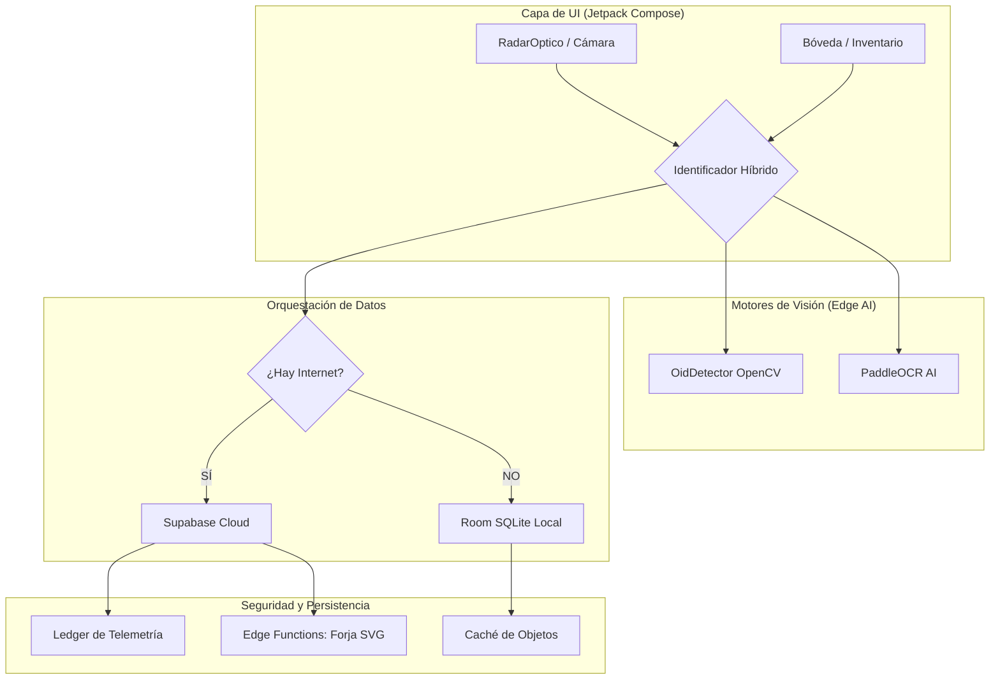
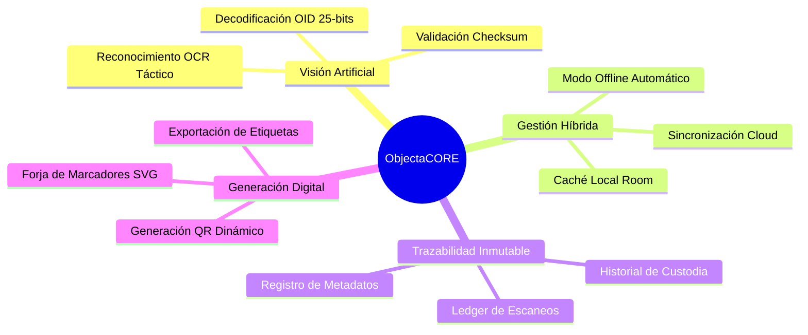

# 🧠 DOCUMENTACIÓN TÉCNICA DE INGENIERÍA: ObjectaCORE

**Sistema de Seguimiento de Activos por Visión Artificial Híbrida**

---

## 1. INTRODUCCIÓN Y PROPÓSITO
**ObjectaCORE** es una solución de ingeniería de software diseñada para resolver el problema de la pérdida de trazabilidad de activos físicos en entornos con conectividad inestable. El sistema permite la identificación inequívoca de objetos mediante un sistema de marcado binario propietario (OID) y visión artificial, garantizando que el dato capturado se sincronice con una red centralizada o se preserve de forma inmutable en el dispositivo.

---

## 2. ARQUITECTURA GENERAL (High-Level Design)
ObjectaCORE utiliza una arquitectura **Clean-Reactive-Hybrid**. El sistema está diseñado para garantizar la integridad de los datos mediante un flujo que prioriza la nube pero mantiene total autonomía local.

### 🗺️ Mapa de Arquitectura

---

## 3. MAPA CONCEPTUAL DE FUNCIONALIDADES
El sistema se divide en cuatro ejes operativos fundamentales:

---

## 4. ANÁLISIS DETALLADO DE COMPONENTES (Deep Dive)

### 4.1. Identificación Híbrida (Offline-First)
El componente `IdentificadorHibrido` actúa como el cerebro lógico. No es un simple puente; es un sistema de decisión que maneja el ciclo de vida del dato:
1.  **Prioridad Nube:** Consulta `SupabaseManager` para obtener datos en tiempo real.
2.  **Fallback Resiliente:** Ante latencia o falta de red, conmuta a `AppDatabase` (Room) en microsegundos.
3.  **Inyección de Telemetría:** Cada identificación exitosa dispara un evento al **Ledger**, asegurando que el activo sea rastreable.

### 4.2. El Radar Óptico y OidDetector (OpenCV 4.5)
*   **Segmentación del Telar:** `OidDetector` no solo lee bits; segmenta el marcador del entorno usando transformaciones de perspectiva de OpenCV.
*   **Validación Criptográfica:** Implementa un Checksum `(ID % 255)`. Esto elimina el ruido visual y garantiza que solo los marcadores "forjados" por el sistema sean procesados.
*   **Ancla Fija:** Utiliza un patrón de bits inicial (101) para determinar la orientación correcta del marcador.

### 4.3. Motor de Visión OCR (`PaddleCerebro.kt`)
*   Utiliza modelos optimizados para móviles que permiten leer identificadores alfanuméricos en placas metálicas o etiquetas dañadas donde los códigos ópticos fallan.

---

## 5. ESPECIFICACIONES TÉCNICAS (MVP Stack)

| Componente | Tecnología | Justificación |
| :--- | :--- | :--- |
| **Backend** | Supabase | PostgreSQL, Realtime, Edge Functions escalables. |
| **Base de Datos Local** | Room | Persistencia SQLite robusta con soporte de Corrutinas. |
| **Visión** | OpenCV 4.5 | Estándar industrial para procesamiento de imagen (JNI). |
| **IA / OCR** | PaddleOCR | Inferencia de IA local de alta precisión en dispositivo. |
| **Interfaz (UI)** | Jetpack Compose | Desarrollo reactivo y declarativo moderno. |
| **Configuración** | DataStore | Manejo de preferencias asíncrono y seguro. |

---

## 6. LÓGICA DE NEGOCIO Y TRAZABILIDAD

### 6.1. El Ledger de Telemetría (Audit Trail)
Cada escaneo se registra como un `RegistroLedger`. Este objeto garantiza una cadena de custodia inmutable mediante la inyección en Supabase de:
*   `codigo_numerico`: El ID único del activo de 25 bits.
*   `evento`: (ej: "SIGHTING", "TRANSFER", "AUDIT").
*   `metadatos`: Mapa flexible para geolocalización o estado del activo.

### 6.2. Sistema de Forja Digital
Mediante `SupabaseManager.forjarMarcadorSvg()`, la app delega la creación compleja del vector visual (SVG) a microservicios en la nube, optimizando el consumo de batería y CPU del dispositivo móvil.

---

## 7. ANÁLISIS DE SEGURIDAD Y RESILIENCIA
1.  **Integridad:** El checksum de 8 bits garantiza que no se procesen IDs corruptos por ruido visual.
2.  **Disponibilidad:** El modo híbrido asegura que la app sea útil el 100% del tiempo, independientemente del proveedor de red.
3.  **Inmutabilidad:** El Ledger en Supabase actúa como una base de datos de solo-escritura para eventos históricos, evitando la manipulación de registros.

---

## 8. GUÍA PARA FUTURAS AMPLIACIONES
1.  **Sincronización Bidireccional:** Implementar `WorkManager` para subir logs locales acumulados de forma automática.
2.  **Realidad Aumentada (AR):** Superponer información de `ObjetoActivo` sobre el frame de la cámara en tiempo real.
3.  **Cifrado Avanzado:** Implementar `SQLCipher` para proteger la base de datos `objectacore_boveda_local.db` con seguridad biométrica.

---
**Documentación actualizada (v1.0). Este informe representa el estado actual del MVP y la visión de ingeniería de ObjectaCORE.**
